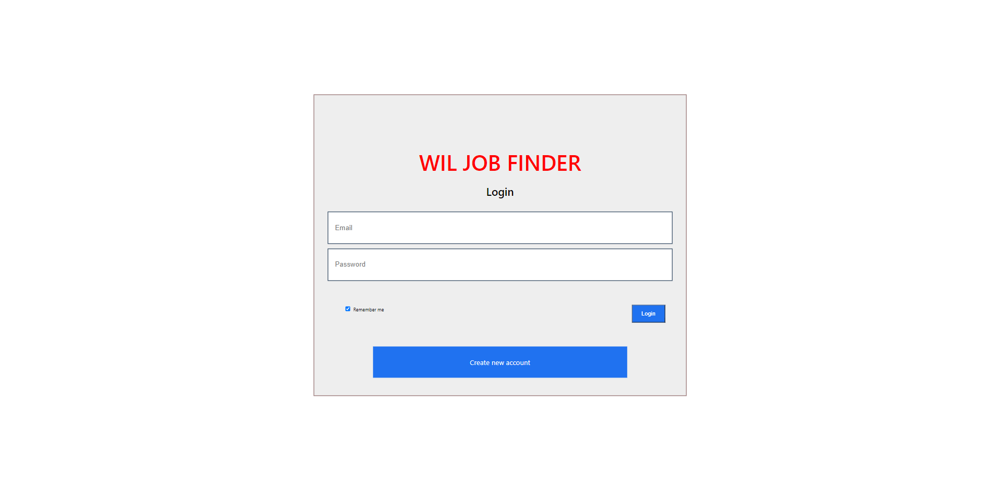

# willjob
<h1> Introduction</h1>

Will job is web aplication which was purposely created for job seeker and employer. Employer in this application can create their own profile , post job , view application and select candidates. On the other hand job seeker can create the profile, search and apply for the job.

<h1> Tools used in application </h1>

NodeJS, ReactJS, MySQL, VScode, deployed in Heruko

<h1> User Interface </h1>

<h3>login page</h3>

<h3> Register </h3>

<h3> Profile </h3>

<h3> Post Job </h3>

